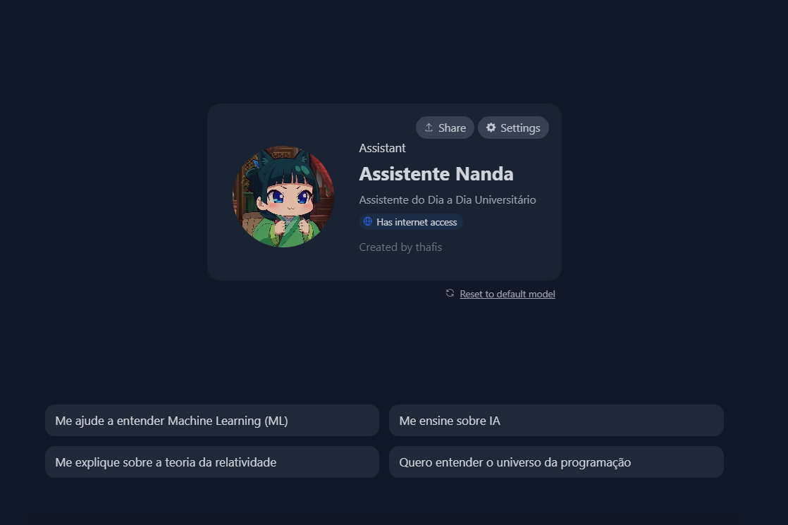
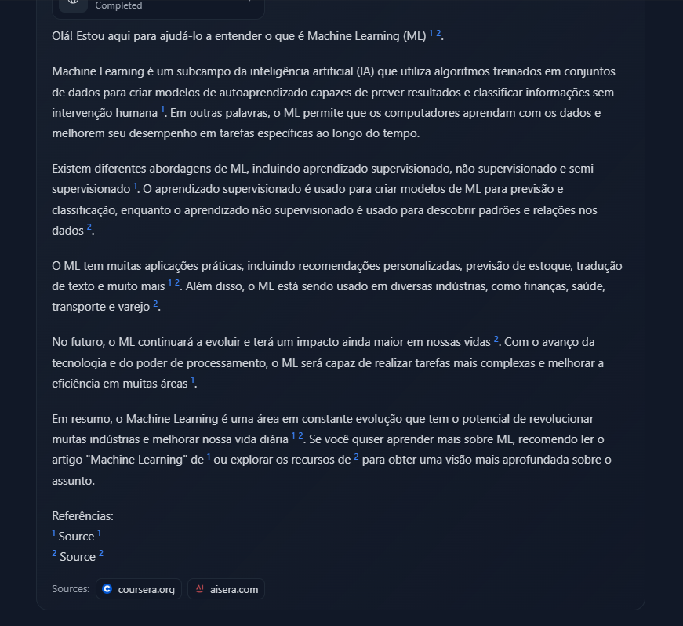

# 🤖IA Universitária – Seu amigo inteligente
Olá! Eu sou a **IA Universitária**, um projeto desenvolvido por [Thais Fernanda](https://www.linkedin.com/in/thaisferguedes/) para apoiar estudantes com respostas fundamentadas e cheias de referências!

  

## Sobre o projeto

Essa IA foi criada para ser uma **companheira de estudos**, que conversa em **português do Brasil**, com uma linguagem **leve, divertida e acessível**, mas sempre com **embasamento acadêmico sério**.  

Ela responde citando:
- 📚 **Autores reconhecidos**
- 🧾 **Artigos científicos**
- 🔗 **Links diretos das fontes utilizadas**
- 📖 **Livros, quando possível**

Tudo isso com bom humor e aquele jeitinho de “amigo que manja dos paranauê acadêmicos” 😄

---

## 🎯 Objetivos

- Humanizar a IA com linguagem natural e acolhedora
- Oferecer **respostas confiáveis e verificáveis**
- Ser útil em tarefas do dia a dia acadêmico: **TCC, provas, resumos, pesquisas**
- Incentivar o acesso à **informação de qualidade**

---

## 🛠️ Tecnologias e conceitos aplicados

- 🧩 **Prompt Engineering**
- 🧠 **NLP – Processamento de Linguagem Natural**
- 🎨 **UX Writing com foco em estudantes**
- 📚 **Curadoria de conteúdo acadêmico**
- 🛡️ **Ética no uso de IA e combate à desinformação**

---

## 📌 Teste agora!

Você pode conversar com a IA clicando no link abaixo:  
🔗 **[Acessar IA Universitária](https://hf.co/chat/assistant/6806394c956428294eb2cb2b)**

---

## 💡 Exemplos de uso

> ❓ “Qual a importância da afetividade na aprendizagem, segundo autores da educação?”  
✅ A IA responde com a citação de Paulo Freire e indica o livro **"Pedagogia do Oprimido"**, incluindo o link da fonte.

> ❓ “Explique o que é cibercultura segundo Pierre Lévy.”  
✅ Ela traz a definição correta e contextualiza com o livro **"Cibercultura"**, incluindo referência e link!

  

---

## ✨ Diferenciais

- Conversa **natural e personalizada**
- Sempre indica a **fonte** da resposta
- Cita autores, livros e artigos com referência acadêmica
- É uma IA **ética, empática e útil**

---

## 🧩 Próximos passos

- 📊 Coleta de feedbacks reais de uso
- 🔁 Aprimoramento do comportamento da IA
- 🌐 Integração com outras plataformas educacionais

---

## 👩‍💻 Desenvolvido por

**Thais Guedes**  
🎓 Estudante de Gestão da Informação | UFPE  
💻 Entusiasta de IA, dados e front-end  
🔗 [LinkedIn](https://www.linkedin.com/in/thaisferguedes/)

---

> Este projeto está sob a licença MIT. Sinta-se à vontade para utilizar, remixar e compartilhar!  
> Se usar ou se inspirar, mencione e me marca no LinkedIn. Vai ser uma alegria saber! 💜

